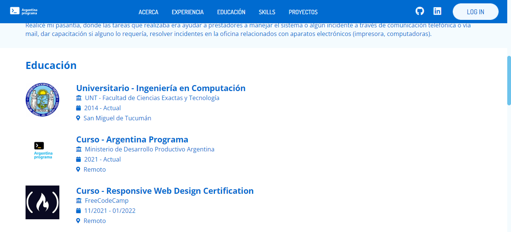
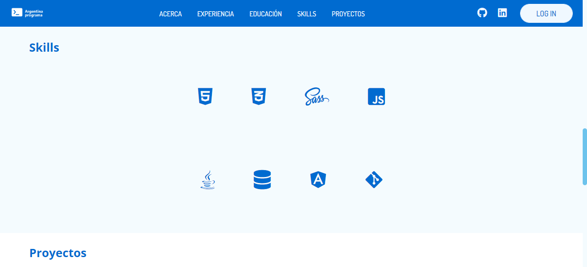

# Argentina Programa

Esta maqueta fue realizada para el portfolio de proyecto final para Argentina Programa segunda estapa #SeProgramar

### Screenshots

### Links

- Página URL: https://beatrizang.github.io/portfolioMaquetaAP/

### Built with

- Semantic HTML5 markup
- CSS custom properties
- Flexbox
- CSS3
- JS

